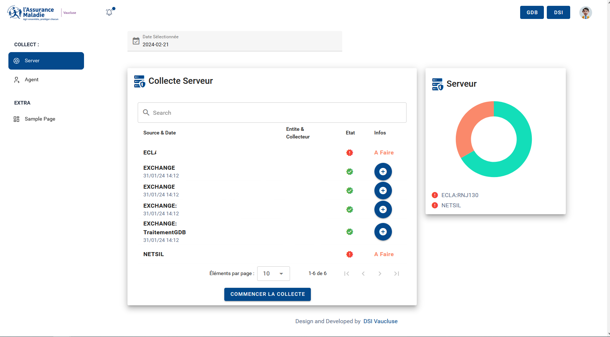
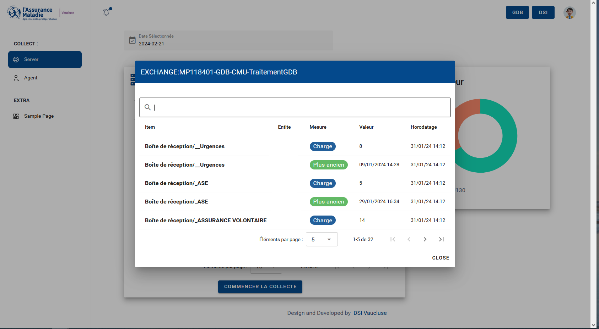

# Vue 3 + Vite + Vuetify Dashboard

This dashboard was developed as part of my alternance at CPAM Vaucluse, focusing on user interface development to simplify the usage of automated workflows for CPAM agents. Utilizing Vue JS and Vuetify JS, the dashboard provides an intuitive graphical interface, facilitating the access to and management of automated tasks.

## Dashboard Features:

- **Collecte Serveur**: Streamlines the data collection process from various sources, ensuring CPAM agents have the most up-to-date information.
  

- **Monitoring & Management**: Offers a real-time overview of system status and allows agents to initiate data collection processes.
  

The application was designed with a focus on efficiency and usability. By integrating Vuetify, a Vue UI Library, it offers a responsive design and an engaging user experience. The use of Vue 3's Composition API, along with the `<script setup>` feature, provides a more concise and easier-to-read codebase.

The dashboard's backend, built with Node-RED, interfaces with various CPAM systems, pulling data into the Vue frontend. This allows for a seamless flow of information from the backend processes to the front-end interface, where agents can interact with the data through a series of automated and user-initiated actions.

## Recommended IDE Setup

- [VS Code](https://code.visualstudio.com/) + [Volar](https://marketplace.visualstudio.com/items?itemName=Vue.volar) (and disable Vetur) + [TypeScript Vue Plugin (Volar)](https://marketplace.visualstudio.com/items?itemName=Vue.vscode-typescript-vue-plugin).

For further details on Vue 3's Composition API and the `<script setup>` feature, check out the [script setup docs](https://v3.vuejs.org/api/sfc-script-setup.html#sfc-script-setup).

This dashboard is part of a larger effort to digitize and automate CPAM Vaucluse's processes, reducing manual workload and increasing operational efficiency.
